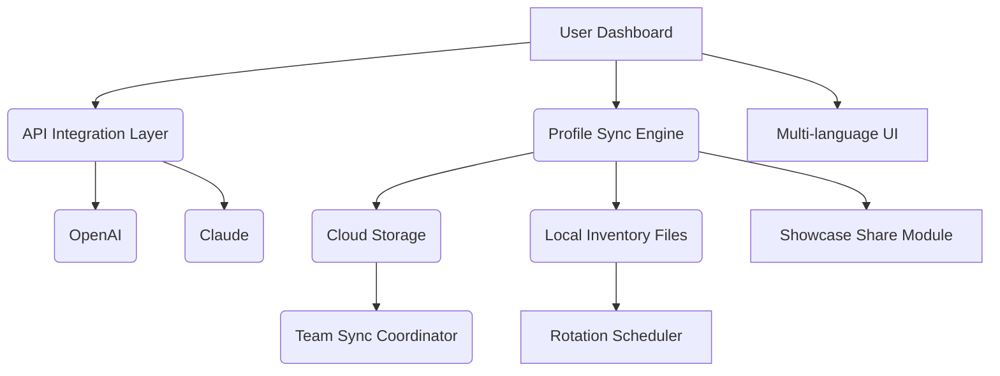

# 🎮🔀 CS2-Skin-Styler-2026  

**The Ultimate Alternative Skin Management Tool for Counter-Strike 2**  
*Seamlessly personalize and organize your in-game inventory with innovative, legitimate utilities and unmatched style flexibility.*

---

---

## 🌟 Project Overview

CS2-Skin-Styler-2026 is a next-generation skin organization suite designed for Counter-Strike 2 (CS2) players who love to personalize their gameplay experience while maintaining fair competition.

Inspired by community needs, Skin-Styler-2026 enables users to visually simulate loadouts, schedule skin rotations, and showcase personal collections across every round and match. Fully responsive, multilingual, and enhanced for both individual enthusiasts and esports teams, this toolkit empowers you to stand out and streamline your armory — all with integrity and ease.

**Key capabilities include:**
- Dynamic skin set management
- Secure OpenAI and Claude API integrations for profile and title generation
- A frictionless, legal, and supportive approach to customizing profiles  
- Community-driven feature expansion targeting both casuals and professionals

---

## 🏆 Features List

- **Responsive UI**: Experience a seamless interface, optimized for desktop, mobile, and tablet users.
- **Multilingual Support**: Switch between over 20 languages, with auto-detect capabilities.
- **Cloud-Based Profile Synchronization**: Access your profiles from anywhere, securely.
- **24/7 Customer Support**: Real-time live chat 🌐, chatbot integration, and developer Q&A.
- **Automated Skin Rotation Calendars**: Plan and display different skin arrangements for tournaments, streams, or daily play.
- **Profile Customization Suggestions**: Generate creative, unique inventory titles, tags, and banner graphics powered by OpenAI and Claude APIs.
- **Security-first Approach**: All configurations reside locally or in private cloud storage—no risk of game bans or vulnerabilities.
- **Shareable Showcase Links**: Safely invite friends or recruiters to view your stylized inventory and play history.
- **Team Inventory Sync**: Allow esports teams to sync and strategize their visuals for coordinated impact.
- **Cross-Platform Compatibility**: Designed for Windows, macOS, and Linux distributions.

---

## 🌐 SEO-Friendly Integrations

CS2-Skin-Styler-2026 sits at the crossroads of Player Experience Optimization, Legitimate Customization Tools, and Esports Enhancement. If you’re searching for "CS2 skin loadout organizer," "Counter-Strike 2 skin portfolio utility," or "esports inventory management tools," you’re in the right place.

Explore our advanced suite of features — including cloud-based sync, OpenAI and Claude integration, automated rotation, and a visually compelling UI — and see why CS2-Skin-Styler-2026 sets the standard in safe CS2 personalization for 2026.

---

## 🖥️🔍 OS Compatibility Table

| Platform | Native Support | Tested in 2026 | Notes        |
|----------|---------------|----------------|--------------|
|  | ✅ | ✅ | Full Feature Set |
|       | ✅  | ✅ | M1/M2 Supported  |
|        | ✅ | ✅ | Flatpak & AppImage ready |

---

## 🤖 OpenAI API & Claude API Integration

CS2-Skin-Styler-2026 harnesses powerful AI platforms to take your inventory organization to the next level:

- **OpenAI**: Suggest skin combinations, generate creative cosmetic titles, and annotate profiles with compelling descriptions.
- **Claude**: Summarize play statistics, auto-generate unique inventory banners, and assist with multilingual translation within the UI.

**Setup:**
1. Obtain API keys via approved developer processes from OpenAI and ClaudeAI.
2. Enter your credentials in the `api/settings.json` configuration file.
3. Enjoy tailored in-app enhancements securely — your keys are never transmitted externally.

---

## 🧩 Example Profile Configuration

Here’s a sample segment from a `profile.inventory.json` to spark your creative organization:

{
    "username": "AgentPhoenix",
    "primarySet": "Fire n' Ice Showcase",
    "rotationSchedule": [
        { "skin": "AK-47 | Neon Rider", "date": "2026-03-02" },
        { "skin": "AWP | Asiimov", "date": "2026-03-09" }
    ],
    "teamSync": true,
    "styleTags": ["tournament-ready", "vintage", "esports"]
}

---

## 💻 Example Console Invocation

Run the organizer in headless batch mode using:

cs2-skinstyler organize --profile=myProConfig.json --lang=es --theme=dark

- Loads your chosen configuration
- Sets interface language to Spanish
- Activates dark UI theme for night sessions

Automate your setup, bootstrap profile showcases in seconds, and never miss a beat — whether prepping for a major LAN or local stream.

---

## 👁️‍🗨️ Mermaid Diagram: System Architecture

The ecosystem may look complex under the hood, but here's a bird’s-eye schematic showing how Skin-Styler-2026 brings harmony to your inventory orchestration:

---

## 🌍 Multilingual Support

- 🇺🇸 English
- 🇪🇸 Español
- 🇨🇳 中文
- 🇩🇪 Deutsch
- 🇫🇷 Français
- 🇷🇺 Русский
- 🇯🇵 日本語
- ...and 20+ more!  
Regional language packs autoload. Contribute more on our [Localization Page](#).

---

## 📜 License

Licensed under the [MIT License](https://github.com/blankerdi/CS2-Skin-Styler-2026/blob/main/LICENSE).

---

## ⚠️ Disclaimer

CS2-Skin-Styler-2026 *does not interact with the official CS2 game files* nor does it grant or simulate access to restricted or commercial in-game items. It serves purely as a creative and organizational utility. Respect the Terms of Service of all connected platforms. This project is community-driven, prioritizes integrity and transparency, and offers no warranty or guarantee of feature permanence. All use is at your own discretion. For compliance, always check the latest CS2 community guidelines. (© 2026)

---

## 📥 Download

Ready to orchestrate your Counter-Strike 2 collection in style? Secure your copy:

---

*CS2-Skin-Styler-2026 — Elevate, Personalize, and Innovate Your Esports Experience for 2026 and beyond!*